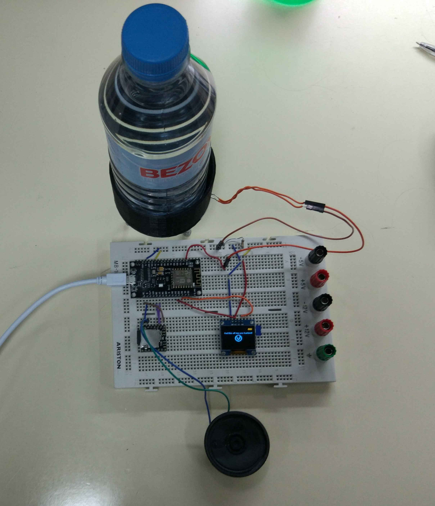

# Audio-Visual-Feedback-Scale
Date: 20 to 22 November 2019  
Authors: Aykut Koc and Abel Matser

Two day project for a single week course of the Athens exchange programme in Madrid. The device measures force using a single FSR and gives feedback by audio and visual means.

